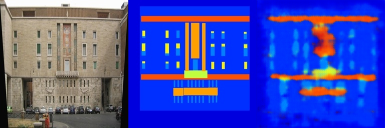

# Assignment 2 - DIP with PyTorch

### In this assignment, you will implement traditional DIP (Poisson Image Editing) and deep learning-based DIP (Pix2Pix) with PyTorch.

### Resources:
- [Teaching Slides](https://pan.ustc.edu.cn/share/index/66294554e01948acaf78)
- [Paper: Poisson Image Editing](https://www.cs.jhu.edu/~misha/Fall07/Papers/Perez03.pdf)
- [Paper: Image-to-Image Translation with Conditional Adversarial Nets](https://phillipi.github.io/pix2pix/)
- [Paper: Fully Convolutional Networks for Semantic Segmentation](https://arxiv.org/abs/1411.4038)
- [PyTorch Installation & Docs](https://pytorch.org/)

### 1. Poisson Image Editing with PyTorch

Fill the [Polygon to Mask function](run_blending_gradio.py#L95) and the [Laplacian Distance Computation](run_blending_gradio.py#L115) in `run_blending_gradio.py`.

### 2. Pix2Pix with Fully Convolutional Layers

Fill the [Fully Convolutional Network](Pix2Pix/FCN_network.py#L3) in `Pix2Pix/FCN_network.py`, then train the model on the Facades dataset.

---
## Implementation of DIP with PyTorch

This repository is yusen wu's implementation of Assignment 02 of DIP.

## Requirements

To install requirements:

```setup
python -m pip install -r requirements.txt
```

## Running

To run the Poisson image blending demo, run:

```poisson
python run_blending_gradio.py
```

To download the facades dataset, run:

```pix2pix-download
cd Pix2Pix
bash download_facades_dataset.sh
```

To train the fully convolutional network, run:

```pix2pix-train
cd Pix2Pix
python train.py
```

## Results

### Poisson Image Editing


### Pix2Pix


Training and validation visualizations are saved to:

- `Pix2Pix/train_results/`
- `Pix2Pix/val_results/`

Model checkpoints will be saved to:

- `Pix2Pix/checkpoints/`

## Acknowledgement

Thanks for the algorithms proposed by [Poisson Image Editing](https://www.cs.jhu.edu/~misha/Fall07/Papers/Perez03.pdf) and [Pix2Pix](https://phillipi.github.io/pix2pix/).
