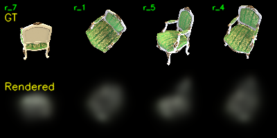

# Assignment 4 - Simplified 3D Gaussian Splatting

This directory contains the implementation of Assignment 04 of DIP:
- `Task 1`: Structure-from-Motion with COLMAP
- `Task 2`: simplified 3D Gaussian Splatting with pure PyTorch
- `Task 3`: comparison and discussion against the official 3DGS implementation

## Contents

- `data/chair/images/`: input multi-view images used in this report
- `mvs_with_colmap.py`: COLMAP sparse reconstruction pipeline
- `debug_mvs_by_projecting_pts.py`: COLMAP point reprojection visualization
- `gaussian_model.py`: learnable 3D Gaussian parameterization
- `gaussian_renderer.py`: differentiable projection, Gaussian evaluation, and alpha blending
- `train.py`: simplified 3DGS training script
- `render_3dgs_mv.py`: optional multi-view video rendering script
- `data/chair/sparse/0_text/`: COLMAP text model used by the training loader
- `data/chair/projections/`: Task 1 reprojection check results
- `data/chair/checkpoints_simple/`: short Task 2 training results

## Environment

The experiments were run on Windows with:
- COLMAP 4.0.3 CUDA build: `D:\study\DIP\colmap-x64-windows-cuda\bin\colmap.exe`
- PyTorch with CUDA available

The original COLMAP script used older option names. I updated it for COLMAP 4.0.3:
- `--FeatureExtraction.use_gpu`
- `--FeatureMatching.use_gpu`

## Task 1

Run COLMAP sparse reconstruction:

```bash
cd D:\study\DIP\DIP-course-assignment\Assignments\04_3DGS
set PATH=D:\study\DIP\colmap-x64-windows-cuda\bin;%PATH%
python mvs_with_colmap.py --data_dir data/chair
```

Check sparse points by reprojecting them into all views:

```bash
python debug_mvs_by_projecting_pts.py --data_dir data/chair
```

Current Task 1 outputs:
- `data/chair/database.db`
- `data/chair/sparse/0/`
- `data/chair/sparse/0_text/`
- `data/chair/projections/`

Task 1 result summary:
- `registered_images = 100`
- `sparse_points = 13702`
- The generated reprojection images show that the recovered sparse points project back onto the chair views, so the COLMAP model is suitable as a 3DGS initialization.

## Task 2

The simplified 3DGS implementation fills the required TODOs in the assignment framework.

Implemented modules:
- `gaussian_model.py`: constructs 3D covariance matrices from quaternion rotations and log-space scales using `L = R S` and `Sigma = L L^T`.
- `gaussian_renderer.py`: projects 3D Gaussian means and covariances to the image plane using the perspective Jacobian.
- `gaussian_renderer.py`: evaluates 2D Gaussian density values on the pixel grid.
- `gaussian_renderer.py`: performs front-to-back alpha blending with depth-sorted Gaussians.

I also added small robustness improvements for the local environment:
- Pure PyTorch KNN initialization is used instead of requiring `pytorch3d`.
- Standard-library natural sorting is used instead of requiring `natsort`.
- Near-singular projected 2D covariances are handled with a stable analytical 2x2 inverse.
- Invalid or out-of-depth Gaussians are masked before density evaluation.

Full training command:

```bash
python train.py --colmap_dir data/chair --checkpoint_dir data/chair/checkpoints --num_epochs 200 --device cuda
```

Short training command used for this report:

```bash
python train.py ^
  --colmap_dir data/chair ^
  --checkpoint_dir data/chair/checkpoints_simple ^
  --num_epochs 10 ^
  --max_images 12 ^
  --max_points 1000 ^
  --debug_every 1 ^
  --debug_samples 4 ^
  --device cuda ^
  --skip_video
```

Current Task 2 outputs:
- `data/chair/checkpoints_simple/checkpoint_000000.pt`
- `data/chair/checkpoints_simple/debug_images/epoch_0009.png`
- `data/chair/checkpoints_simple/summary.txt`

Short training summary:
- `device = cuda`
- `num_epochs = 10`
- `training_images = 12`
- `initialized_points = 1000`
- `final_epoch_avg_l1_loss = 0.0997`

The short run is intentionally lightweight. It verifies that the differentiable rasterization pipeline works end-to-end and produces a visible chair silhouette. The result is still blurry because the run uses a small subset of points and views, no adaptive densification, and only 10 epochs.

Final debug image:



## Task 3

Compared with the official 3D Gaussian Splatting implementation, this assignment implementation is much simpler:
- Rendering quality: the official implementation uses adaptive Gaussian densification, pruning, anisotropic covariance optimization, spherical harmonics, and a CUDA rasterizer. This simplified version uses fixed initialization from sparse COLMAP points and plain RGB colors, so early results are blurrier and less detailed.
- Training speed: the official implementation uses a tile-based CUDA rasterizer. This implementation evaluates all Gaussians over the image grid in PyTorch, which is much slower and scales poorly with image size and point count.
- Memory usage: the official renderer avoids materializing unnecessary full `N x H x W` tensors through optimized rasterization. The pure PyTorch version is easier to read but consumes much more memory for large scenes.

In this repository, I completed and tested the simplified PyTorch implementation. The official 3DGS repository is not included locally, so the comparison above focuses on implementation-level differences and expected behavior under the same data.

## Notes

The default assignment command still runs the full dataset and full point cloud if no quick-experiment arguments are provided. The additional options below are only for fast local checks:
- `--max_images`
- `--max_points`
- `--skip_video`
